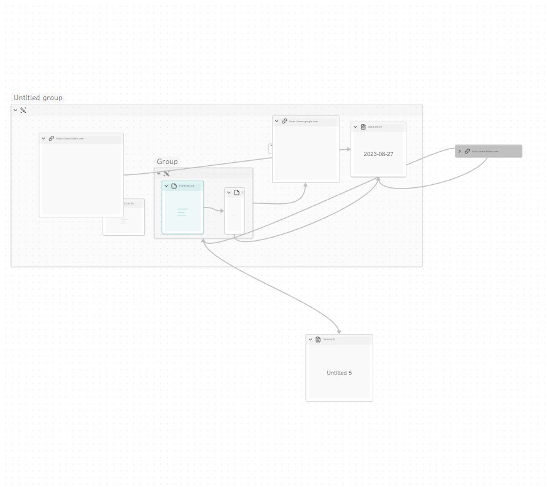

# Obsidian Collapse Node

A plugin for [Obsidian](https://obsidian.md) that helps you collapse node in canvas.

## Usage

-   Commands
    -   `Fold All Nodes` - Collapses all nodes in the workspace
    -   `Expand All Nodes` - Expands all nodes in the workspace
    -   `Fold Selected Nodes` - Collapses only the selected nodes
    -   `Expand Selected Nodes` - Expands only the selected nodes
-   Context menu in canvas
    -   `Selection Menu` - Shows the context menu for selected nodes
    -   `Node Menu` - Shows the context menu for a specific node or nodes
    -   `Set Node Alias` - Set a custom alias for the node (shown in collapsed state)
    -   `Set Node Thumbnail` - Set a custom thumbnail image for the node (shown in collapsed state)
    -   `Remove Node Customizations` - Remove alias and thumbnail from the node
-   Direct Click on the Header
    -   `Click` - Collapse or expand the node
-   Thumbnails and Aliases in Collapsed State
    -   Enable in settings to show thumbnails and/or aliases when nodes are collapsed
    -   For thumbnails: Add `thumbnail: path/to/image.jpg` or `thumbnail: https://example.com/image.jpg` to node metadata, or use the context menu
    -   For aliases: Add `alias: Your Alias Text` to node metadata, use frontmatter aliases for file nodes, or use the context menu

## Installation

-   Not ready for market yet
-   Can be installed via the [Brat](https://github.com/TfTHacker/obsidian42-brat) plugin
-   Manual installation

1. Find the release page on this github page and click
2. Download the latest release zip file
3. Unzip it, copy the unzipped folder to the obsidian plugin folder, make sure there are main.js and manifest.json files
   in the folder
4. Restart obsidian (do not restart also, you have to refresh plugin list), in the settings interface to enable the
   plugin
5. Done!

## Support

If you are enjoying this plugin then please support my work and enthusiasm by buying me a coffee
on [https://www.buymeacoffee.com/boninall](https://www.buymeacoffee.com/boninall).
.

